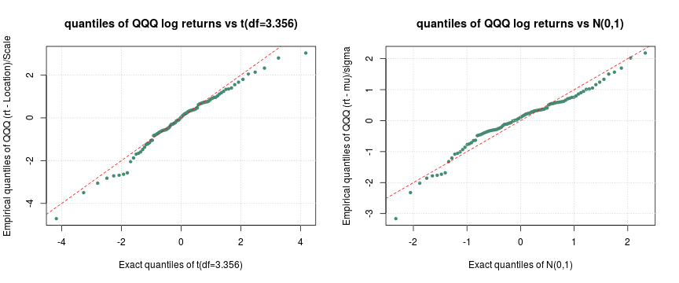
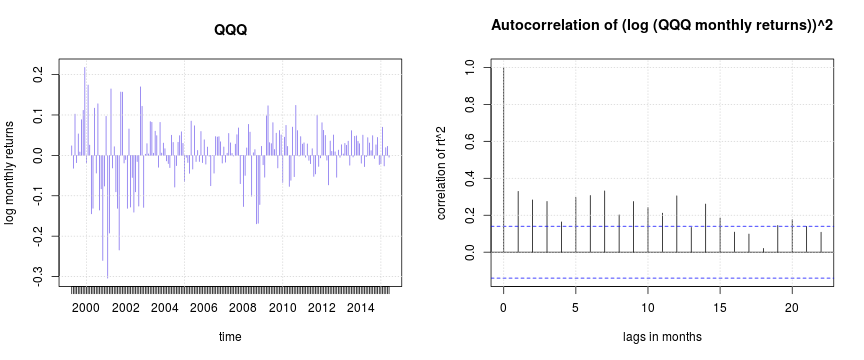
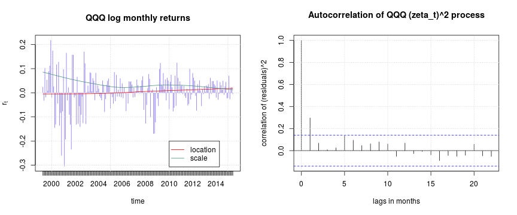
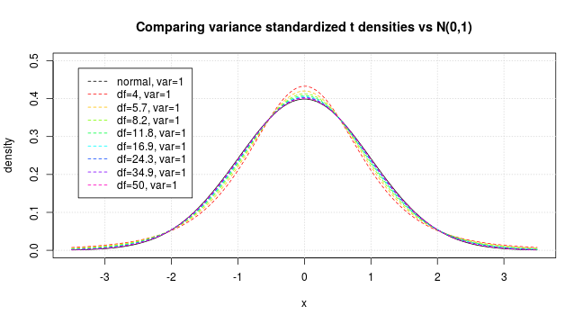
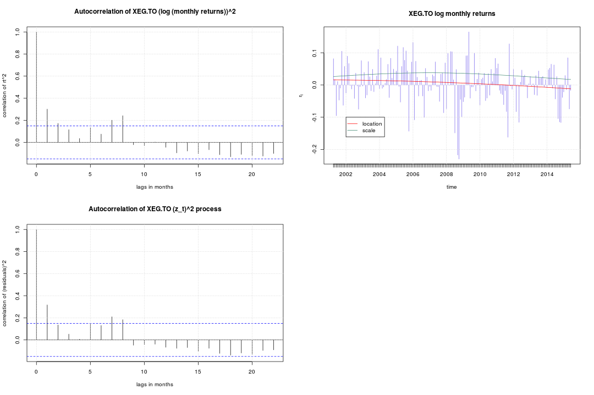

# Summary #
The _Constant Expected Returns_ model (CER for short) is widely used in finance to model returns on securities.
However, practitioners find this model confounded by _heaviness of tails of the distributions_
on the one hand, and correlation of the observations on the other.
This note produces empirical evidence that some of the apparent heaviness of distribution tails
and data correlation are consequences of assuming fixed location and scale parameters (return and volatility).
In brief, the 'C' in CER may be part of the problem.

We obtain the data for this work from [Yahoo Finance Canada](https://ca.finance.yahoo.com/)
using the [quantmod](http://CRAN.R-project.org/package=quantmod) [@quantmod] package of
[R 3.2.0]({http://www.R-project.org/}).


```r
rm (list = ls())
library (quantmod)
```

# Some background #
Let $P_t$ be the adjusted closing (monthly) prices of some security $S$. We recall
[@ruppertfinance chapter 2]
 that
the _simple returns process_ $R_t$ of $S$ is defined as:
$$ R_t \stackrel{\Delta}{=} \dfrac{P_t - P_{t-1}}{P_{t-1}} $$
and the _log returns process_ $r_t$ of $S$ is defined as:
$$ r_t  \stackrel{\Delta}{=} \log\left(1 + R_t\right)
\;\;
\mbox{such that for $k \geq 1$:}
\;\;
P_{t+k} = P_t\,\exp\left(\sum_{j=1}^{k} r_{t+j}\right)
$$
The CER model 
(see for instance [Prof. Zivot's note](http://faculty.washington.edu/ezivot/econ424/constantexpectedreturn.pdf))
assumes that the variable $r_t$ has the form:
$$ r_t = \mu + \sigma\,\epsilon_t $$
where $\epsilon_t$'s are assumed IID standard Gaussian, and $\mu$ is the _mean return_
and $\sigma$ is the _volatility_.
([Professor Eric Zivot](http://faculty.washington.edu/ezivot/)
of Washington University very descriptively calls
the unpredictable part $\epsilon_t$
_"the news entering the market"_ during period $t$.)
These basic assumptions are, as far as the present author can tell, very crucial to much of
the mathematics of finance; you can see for instance pages 190--199 of @hullfinance.

@ruppertfinance (pg. 87 section 5.5) states that _"equity returns and other changes in
market prices usually have heavy tails"_.
@mcleish (pg. 153) report a similar observation that the
log daily returns process
of the [TSE 300 Composite Index](https://en.wikipedia.org/wiki/TSE_300_index) 
from 1984-01-01 to 1987-12-31 appears to fit a symmetric stable law with
characteristic index $\alpha=1.67$.
Such observations lead one to expand the above model of the unpredictable part $\epsilon_t$
to include symmetric pdf's with tails heavier than the Gaussian. Since now the existence
of the 2nd moment is not necessarily guaranteed one writes
$$ r_t = c + s\, \epsilon_t $$
where $c$ is the _location parameter_  and $s$ is the _scale parameter_.

# Fitting real data #
Consider the [QQQ PowerShares](https://www.invesco.com/portal/site/us/financial-professional/etfs/product-detail?productId=QQQ) formerly called "NASDAQ-100 Index Tracking Stock".


```r
source ("./getTicker.R")		# getTicker is a wrapper on getSymbols{quantmod}
getTicker ("QQQ", auto.assign=TRUE, from="1999-01-01")
```
We can apply the Jarque-Bera test to the returns process `QQQ$rt`.

```r
library (tseries)
if (jarque.bera.test (QQQ$rt)$statistic > qchisq (p=0.95, df=2)) { # page 86 of Ruppert
  cat ("The monthly log returns of QQQ are not Gaussian (CL=0.95)\n")
}
```

```
## The monthly log returns of QQQ are not Gaussian (CL=0.95)
```
Since `QQQ$rt` is not Gaussian, let us fit a locations-scale t-distribution to it;
for this we use our function [`get.tparams.only`](https://github.com/hossainpezeshki/tParams).

```r
source ("./tdistparams.R")
QQQ$tfit <- get.tparams.only (QQQ$rt, lower=2.1, upper=50)
sprintf ("t dist fit to QQQ: df = %.3f, location=%.6f, scale=%.6f",
         QQQ$tfit$nu, QQQ$tfit$Location, QQQ$tfit$Scale)
```

```
## [1] "t dist fit to QQQ: df = 3.356, location=0.011014, scale=0.052388"
```
The following q-q plots show that a  $t_{\nu=3.356}$ distribution for QQQ log returns
appears to be a better fit than a Gaussian model.
 

However, 
the above results were obtained assuming $c$ and $s$ are constants
and that the $\epsilon$'s are independent; but is this
supported by the data? 
As the left panel of the following figure suggests, the log monthly returns are non-stationary
given the events of
[September 11th, 2001](https://en.wikipedia.org/wiki/September_11_attacks).
Also, the right panel displays the dependence of $r_t$ values by plotting
the empirical autocorrelation of the squares of the values.

 

# Time-dependent model #
We allow the location and the scale parameters to be _smooth_ functions of time
in the sense that each is a discretization (here monthly) of a function
of _continuous time_ that is twice continuously differentiable,
and we write

$$ r_t = c_t + s_t \,\,\zeta_t $$
where $\zeta_t$ is the unpredictable news entering the market
during period $t$.
Our function `getCtSt.R` implements the
non-parametric techniques described on pages 87 to 88 of @allofnonparametric
to estimate $c_t$ and $s_t$.
In particular, we use
[our function `hp_loess`](https://github.com/hossainpezeshki/setloessspan)
for automatically selecting optimal span values for `loess{stats}`. 


```r
source ("./getCtSt.R")
set.seed (394385)
QQQ$trend <- getCtSt (QQQ, nl=5, B=100)  # nl gives the granularity of the search for the best span
									# and B is the number of randomized train/test splits
```
At this point we have the estimates $\widehat{c_t}$ and $\widehat{s_t}$
which the following plots help visualize.
Clearly we also have the residuals $\widehat{\zeta_t}$:
$$\widehat{\zeta_t} \stackrel{\Delta}{=} \dfrac{(r_t - \widehat{c_t})}{\widehat{s_t}}$$
which estimate the monthly news $\zeta_t$.


```r
par (mfrow = c(1,2))
plot (QQQ$the_months[2:QQQ$m], QQQ$rt, type='h', col='mediumslateblue',
main="QQQ log monthly returns",
xlab = "time", ylab=expression(r[t])); grid();

lines (QQQ$the_months[2:QQQ$m], QQQ$trend$ct, col='red')
lines (QQQ$the_months[2:QQQ$m], QQQ$trend$st, col='aquamarine4')
legend (x=2010, y=-0.2, legend=c("location", "scale"), lty=c(1,1),
col=c('red', 'aquamarine4'), pch=c(NA,NA))

acf (QQQ$trend$zt^2, xlab="lags in months", ylab="correlation of (residuals)^2",
main="Autocorrelation of QQQ (zeta_t)^2 process"); grid()
```

 
Comparing the latter autocorrelation plot with the earlier one above, we observe a considerable
mitigation of the dependence of the residuals $\widehat{\zeta_t}$, which we now test for Gaussianness.

```r
if (jarque.bera.test(QQQ$trend$zt)$statistic > qchisq (p=0.95, df=2)) {
	cat ("The residuals zeta_t are not Gaussian (CL=0.95)\n")
} else {
	cat ("Can not reject Gaussianness of zeta_t\n")
}
```

```
## The residuals zeta_t are not Gaussian (CL=0.95)
```
Let us fit a $t_{\nu}$ model to $\zeta_t$'s:


```r
QQQ$ztfit <- get.tparams.only (QQQ$trend$zt, lower=2.1, upper=56)
sprintf ("the residuals zeta_t fit t(df=%.3f)", QQQ$ztfit$nu)
```

```
## [1] "the residuals zeta_t fit t(df=56.000)"
```
We note that whereas the QQQ $\epsilon_t$'s above were $t_{\nu= 3.356}$, the $\zeta_t$'s
are $t_{\nu= 56}$; we recall that for large $\nu$, $t_\nu$ approches the Gaussian
as the following plot helps visualize. We thus wonder whether the Jarque-Berta test is
excessively sensitive.

 

# Limitation #
The extent to which our procedure can account for correlation and heaviness of distribution tails
varies considerably for different assets.
To illustrate this we use the
[iShares S&P/TSX Capped Energy Index (XEG.TO)](https://ca.finance.yahoo.com/q?s=XEG.TO&ql=1)
which gives exposure to Canada's oil and gas sector.


```r
getTicker ("XEG.TO", auto.assign=TRUE, from="1990-01-01")
if (jarque.bera.test (XEG.TO$rt)$statistic > qchisq (p=0.95, df=2)) { # page 86 of Ruppert
  cat ("The monthly log returns of XEG.TO are not Gaussian (CL=0.95)\n")
}
```

```
## The monthly log returns of XEG.TO are not Gaussian (CL=0.95)
```
Let us fit a $t_\nu$ distribution to $r_t$ of XEG.TO:

```r
XEG.TO$tfit <- get.tparams.only (XEG.TO$rt, lower=2.1, upper=56)
sprintf ("t dist fit to XEG.TO df = %.3f, location=%.6f, scale=%.6f",
         XEG.TO$tfit$nu, XEG.TO$tfit$Location, XEG.TO$tfit$Scale)
```

```
## [1] "t dist fit to XEG.TO df = 6.290, location=0.008592, scale=0.052915"
```
Now we fit our time-dependent model, plot the results as before but notice
that there has been almost no change in the extent of dependence.

```r
XEG.TO$trend <- getCtSt (XEG.TO, nl=5, B=100)
```
 

Let us examine the XEG.TO residuals $\zeta_t$ more closely.

```r
if (jarque.bera.test (XEG.TO$trend$zt)$statistic > qchisq (p=0.95, df=2)) { # page 86 of Ruppert
  cat ("The zeta_t residuals of XEG.TO are not Gaussian (CL=0.95)\n")
} else {
	cat ("Cannot reject Gaussianness of XEG.TO zeta_t process")
}
```

```
## The zeta_t residuals of XEG.TO are not Gaussian (CL=0.95)
```
Let us fit a $t_{\nu}$ distribution to the residuals $\zeta_t$.

```r
XEG.TO$ztfit <- get.tparams.only (XEG.TO$trend$zt, lower=2.1, upper=50)
sprintf ("t dist fit to zeta_t residuals of XEG.TO df = %.3f, location=%.6f, scale=%.6f",
         XEG.TO$ztfit$nu, XEG.TO$ztfit$Location, XEG.TO$ztfit$Scale)
```

```
## [1] "t dist fit to zeta_t residuals of XEG.TO df = 6.395, location=0.109226, scale=1.725168"
```
That is, for XEG.TO, the $\zeta_t$'s fit $t_{\nu=6.395}$, whereas the $\epsilon_t$'s
fit $t_{\nu=6.290}$, so that only a small part of the heaviness of the tails of the distribution
of XEG.TO log monthly returns is due to assumption that $c$ and $s$ are constants.

# An observation #
It seems to us that the estimates $\widehat{c_t}$ and $\widehat{s_t}$ are of value in and of themselves,
even in "_uncooperative_" cases like XEG.TO data,
in that they highlight the overall trend of the security.


# References #


